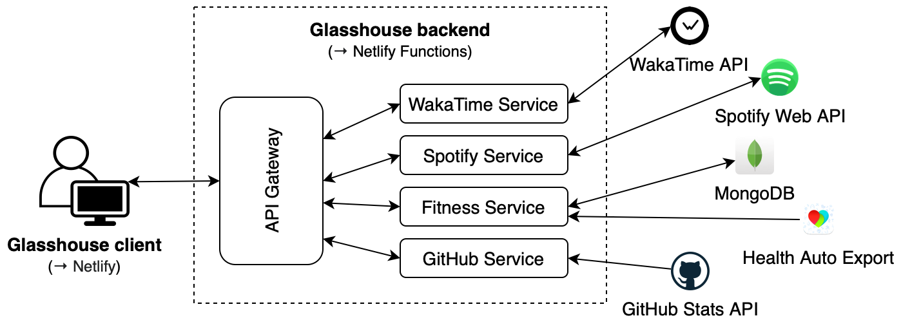

# Glasshouse 👁️

[Glasshouse](https://glasshouse.netlify.app/) is a data dashboard where I gather data from apps I use everyday.

GitHub repositories:

- client: [leo-pfeiffer/glasshouse](https://github.com/leo-pfeiffer/glasshouse)
- back-end: [leo-pfeiffer/glasshouse-backend](https://github.com/leo-pfeiffer/glasshouse-backend)

Currently I've implemented the following data sources:
- Spotify
- Apple Fitness
- WakaTime
- GitHub

## 🔥 Motivation

The project is mainly a fun project that I embarqued on to play with some of the data from the apps I use the most. I wanted to build something that I can easily expand on over time if I want to add new apps.

## 🔧 Technologies

### Back-end
- The backend runs on Netlify using the serverless **Netlify Functions** capability. I had initially deployed the back-end on **Google App Engine**.
- I use **MongoDB** for persistent storage of my Apple Health Data.

### Front-end
- The client is written in **Vue.js**.
- I used **Bulma** as a CSS framework.
- The client is hosted on **Netlify**.

## 📐 Architecture

The architecture of the project is somewhat microservice-esque. The different services (i.e. Spotify, WakaTime, ...) aren't actually run in separate containers, but they are implemented in standalone modules for loose coupling. 

The server exposes and API that serves as a gateway to pass requests from the client to the respective services. The following diagram gives an idea of the architecture.

## 💡 Implementation & Learnings
Implementing the project was a lot of fun! There were quite some aspects in there that I hadn't dealt with before, so learning about new aspects was great.

As mentioned in the architecure section, the API gateway passes client requests to the appropriate microservices. From there, the microservices take over and fulfil the request in one way or another. 

### Spotify service
For the Spotify service, this meant actually talking to the Spotify Web API and processing the result. Getting the required OAuth authentication just right was very interesting - since I couldn't have the user go through the normal login browser to login (since the service is supposed to be automatic after all). 

I solved this by setting an initial access and refresh token that I retrieved manually. Since the access token expires within 60 minutes, I will have to request a new one - which can be done automatically via the refresh token. This way, the user will not have to physically login again and the service can run in the background.

### Fitness service
The second highlight of the implementation was the integration of the Apple Health data. Unfortunately, Apple doesn't provide a public API to retrieve this data. However, I recently found the Health Auto Export app on the export that allows you to post all your Apple Health data to a REST API or upload it to dropbox. 

Therefore, the fitness service of the project needed to process incoming data from the Health Auto Export app's post requests and store it in the MongoDB. The app allows you to run these exports on a regular basis, so as of now, my Apple Health data is posted to the server once a day. When the client requests the fitness data, the fitness service retrieves it from the MongoDB.

### GitHub Service
For the GitHub service, I forked the [GitHub README Stats](https://github.com/anuraghazra/github-readme-stats) and converted it into a [REST API](https://github.com/leo-pfeiffer/github-readme-stats), which I deployed on Vercel. Glasshouse calls those endpoints to gather information about my activity on GitHub.

### Caching
ℹ️ Due to the stateless nature of Netlify Functions, caching with node-cache won't work. Instead, I'd need to use a service such as Redis. 

For the previous version, which was deployed on GCP, I implemented caching to reduce the load on the server and to reduce response time. I used the fairly basic node-cache library, which actually served the purpose very well. Something more powerful such as Redis would certainly have scaled better, but for the scope of the application node-cache very much does the trick. Now that I use the serverless deploymnet, Redis would be required.

Caching was handled by the microservices depending on the data requested. For example, the Spotify service cached the top track and top artists data until the end of the day, whereas the recently played and currently playing data was only cached for 30 seconds.

### Deployment
Initially, I had deployed the back-end on Google App Engine, which worked well, however the deployment and maintenance as pretty laborios for a small API such as this. Thus, I decided to try out Neltify's serverless capabilities for the first time, with Netlify Functions. Netlify Functions allows you to deploy an API without actually running a server.

It turns out that I actually didn't need to change much to move to serverless deployment. Essentially, I pointed the Netlfiy specific functions to the same modules that the Express endpoints had pointed to. Then I could remove the Express server, and that's it! For a super small API such as this, the serverless deployment is certainly advantageous as it is much simpler to set up, and more cost effective.

## 📚 Resources
+ [Health Auto Export App](https://www.healthexportapp.com/)
+ [Spotify Web API](https://developer.spotify.com/documentation/web-api/)
+ [WakaTime API](https://wakatime.com/developers)
+ [MongoDB](https://www.mongodb.com/)
+ [Netlify](https://www.netlify.com)
+ [Netlify Functions](https://www.netlify.com/products/functions/)
+ [Google App Engine](https://cloud.google.com/appengine)
+ [Bulma](https://bulma.io/)
